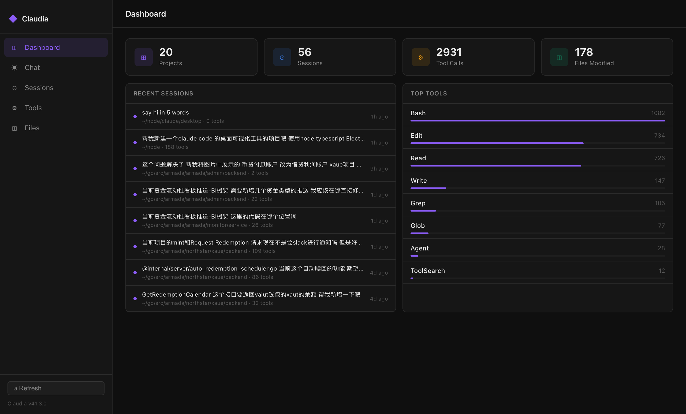

# Claudia

A desktop app for exploring and chatting with your Claude Code sessions.

Built with Electron + TypeScript.



## Features

- **Dashboard** — overview of projects, sessions, tool calls, and file modifications
- **Chat** — browse session history and continue any conversation directly in-app, powered by `claude --resume`
- **Sessions** — browse all projects and sessions with summaries, delete sessions with one click
- **Tools** — searchable log of every tool call across all sessions
- **Files** — files modified or read across sessions

## Requirements

- [Claude Code CLI](https://claude.ai/code) installed and authenticated
- Node.js 18+
- macOS (primary target)

## Getting Started

```bash
npm install
npm start
```

## Development

```bash
# Watch mode (does not auto-launch Electron)
npm run dev

# Build only
npm run build
```

## Tech Stack

- **Electron** — desktop shell
- **TypeScript** — main process, preload, and renderer
- **Vanilla DOM** — no frontend framework, lightweight by design

## Data Source

Claudia reads session data from `~/.claude/projects/`. No data is sent anywhere — everything stays local.

## License

MIT
